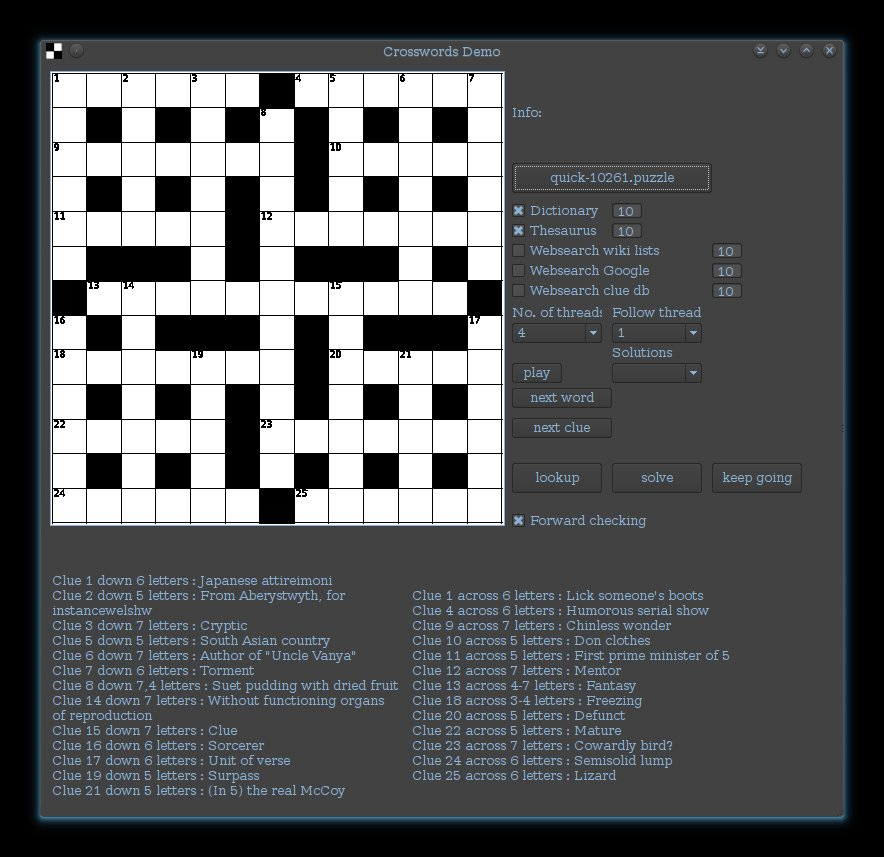
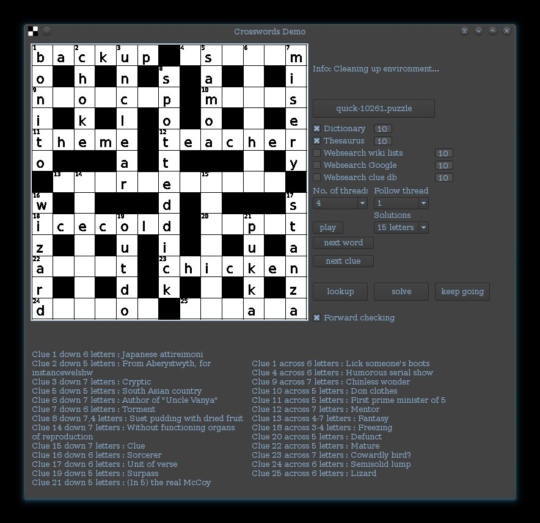
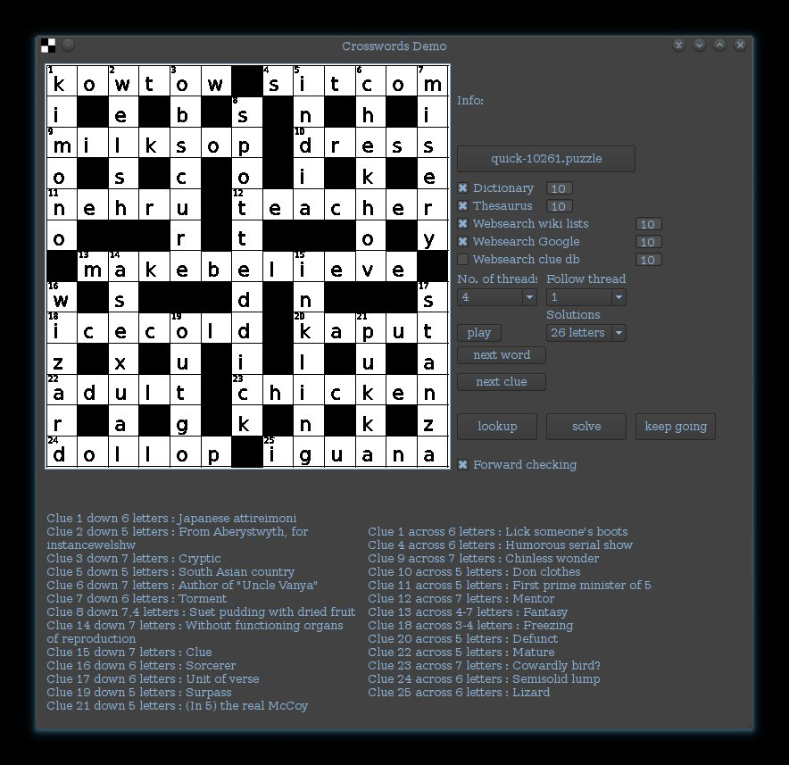

Introduction
========

This was my final year project at Durham University for which I achieved a first class grade. It uses Artificial Intelligence and datamining techniques to parse and solve crossword puzzles. It is implemented in C++03 and depends on libcurl, boost regex and QT4 for the graphical user interface. This application was developed and demonstrated on amd64 linux with GCC 4.6, however there is no reason it cannot be compiled for other platforms.

Overview
=======

The purpose of the project was to create an automated crossword solving system and explore ways of improving its efficiency. The system is split into two part, generating candidate words from crossword clues and finding the most complete solution possible using those words while keeping inline with the rules of the game.

The system sources words from a thesaurus, a reverse dictionary, and several online sites. Mining the web for candidate words was an idea introduced by an earlier project and was something I wanted to expand upon.

The system uses a depth first search algorithm with backtracking and several modular enhancements including forward checking and arc consistency. Details of how the algorithm works and the data structures involved is included in the final paper, Applying AI techniques to solve Crossword Puzzles.pdf.

Greater emphasis was placed on making the solving process as efficient and complete as possible given a selection of words and opposed to finding the one true solution to each given clue. This is apparent in the screenshots below where many of the words share a very tenuous connection to the original clue.

The application is multi threaded to take full advantage of modern processors and includes a graphical user interface to let the user modify configuration options and visualise the solving process by watching the crossword grid periodically update as the system makes its way through the search space.

The initial target was the create a system that could fill in over 50% of the crossword grid on average (50% can be achieved by fitting random words into only down columns or only across columns). Infact, the final system boasted a success rate of close to 75%.

Screenshots
==========

